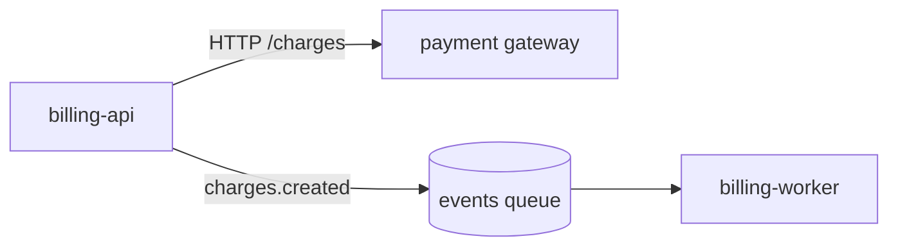

# Structure

**What it decides:** how docs are organised across a team, its systems
and their parts, and where one fact or one page belongs.

## The levels

The words are Backstage's catalog kinds. They work whether or not
Backstage runs here.

| Level | What it is | Its docs live in | Its index page answers |
| --- | --- | --- | --- |
| **Team** (Group) | the people who own several systems | the site repository's home page | which systems we own, how we work, who to ask |
| **System** | components that together give one capability | the site repository, one page per system; or the repository's `docs\index.md` when the system is one repository | what it does, its components, how they connect, its diagram |
| **Component** | one deployable or releasable unit, usually one repository or one package | that repository's `docs\` folder and `README.md` | what it does, how to run, build and test it, its surfaces |
| **API** | an interface a component offers others: HTTP routes, a Python package, messages | the component that offers it | generated reference, where possible |
| **Resource** | a database, a queue, a bucket a component uses | the component that owns it; the system page if several share it | what it holds, who writes and reads it |
| **Code** | a module, a class, a function | its docstring | its contract (`python/docstrings.md`) |

## Organising a team's docs, step by step

1. **For each repository, read the records**: `README.md`,
   `pyproject.toml` (name, scripts), and the owners file
   (`CODEOWNERS`, `.github/CODEOWNERS` or `docs/CODEOWNERS`). Write down
   the owner each file names, or `none`.
2. **Compare the owners with what the person said.** If an owners file
   names someone else ("we own it" but `CODEOWNERS` says `@finance-core`),
   report the conflict under *Not done* and write both in the catalog.
   Do not pick one.
3. **Find the connections in the code**, one search per kind: HTTP
   addresses the code calls (`http://`, `https://`), routes it serves,
   topics it publishes and subscribes to. An arrow exists only where you
   found both ends: a call to `POST /entries` in one repository and the
   route `/entries` in another. Write each arrow with its two `path:line`.
4. **Group the components** (below: System or Component). A component
   whose owners file names a different owner from the rest is its own
   system, linked from the others, even when they talk to it. A system's name
   comes from the people or the records. If none gives one, name the
   group by its repositories ("billing-api and billing-worker") and list
   the missing name under *Not done*. Never invent a name.
5. **Write the pages**: the team page with the catalog, one page per
   system, and links to each component's docs. On the site, a component
   gets one line saying what it does and a link. Install, run and test
   steps stay in the repository's README: take them out of the site, do
   not copy them into new site pages.
6. **Link to a repository's own docs by the full address** where the site
   publishes them, or by its repository address. A relative path from the
   site into another repository (`../../ledger/README.md`) never works.
7. **Run the strict build** (`mkdocs/site.md`).

## Is a part a System or a Component?

1. Is it deployed or released as one unit? **Component.**
2. Is it several such units that only make sense together? **System.**
3. Does it have a different owner from the parent? Its own **System**,
   linked from the parent.
4. Still unsure: treat it as a Component. Promoting it later is cheap.

## Where one fact goes

Find the **lowest level that owns all of it**:

- true of one function: its docstring;
- true of one component: that component's docs;
- about two components of one system (how they talk): the system page;
- about two systems: the team page;
- a convention for everything the team owns: the team page.

Everywhere else links to it. A parent summarises each child in one line
and links down. A child never repeats its parent; it links up.

## A repository's docs

Before adding anything, read the existing layout and keep it. A new page
goes next to pages of the same kind. If there is no layout yet, use:

```
README.md              what it is, how to install, run and test, link to docs
docs/
  index.md             the component's index page (templates/index.md)
  how-to/              one task per page
  reference/           API reference (generated), settings, commands
  explanation/         design and how it works
  adr/                 decision records, numbered: 0001-short-title.md
  runbooks/            one incident or alert per page
```

Create a folder only when its first page is written. An empty folder
tells the reader something exists when it does not.

## The team's catalog

The team page carries one table, the only list of what exists:

| System | Components | Repositories | Owner |
| --- | --- | --- | --- |

Every system in it has a page, and every component row links to that
repository's docs. Fill it from the repositories and from people, never
from names that sound alike. An owner nobody named is left as `ask`.

## Diagrams

One diagram per index page, at that page's level (the C4 model's
levels):

- team page: the systems and what connects them;
- system page: its components, the people and systems around it, and
  the arrows between them, each arrow labelled with what flows (HTTP,
  a queue name, a shared table);
- component page: only if the inside is not obvious from the reference.

Draw with Mermaid in a fenced `mermaid` block, which renders offline when
the site is set up for it (`mkdocs/site.md`). Every box and arrow is a
claim: back each one with navigation (Trace out, Follow) like any
sentence.



## Never

- Never invent a system name, a grouping or an owner. When the code and
  the people do not say, ask, or write `ask` in the catalog.
- Never copy a fact down to a child or up to a parent. Link.
